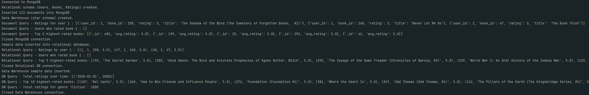

# Data Engineering Assignment 1

## Introduction
This project demonstrates an end-to-end data pipeline that downloads and processes the Goodbooks-10k-updated dataset from Kaggle and persists the data into multiple databases concurrently. The pipeline inserts and queries data from:

Relational Database (PostgreSQL)
Document-based NoSQL Database (MongoDB)
Graph Database (Neo4j)
Data Warehouse (Star Schema on PostgreSQL)

A star schema is a common database design used in data warehousing and business intelligence that organizes data into fact and dimension tables. It’s called a “star” schema because its diagram resembles a star: a central fact table is surrounded by several dimension tables.

Both test2.py and data_pipeline.py implement the data pipeline however test2.py is the latest version.
data_pipeline.py consists of clickhouse and mssql database integration but those don't function properly.
test2.py consists of postgresql, mongodb, neo4j and data warehouse (postgresql) integration.

main.py consists the FastAPI backend for sending requests to the database servers.

### Key Components
Fact Table:
- Central Table: Stores measurable, quantitative data (facts) such as sales amount, number of ratings, or profit.
- Foreign Keys: Contains keys that reference the surrounding dimension tables.
- Aggregations: Often used for summarizing data (sums, averages, counts) across various dimensions.

Dimension Tables:
- Descriptive Attributes: Store detailed attributes (dimensions) related to the facts, such as time, location, product, or customer information.
- Denormalized: Typically denormalized to optimize read performance; they contain redundant information that’s useful for query filtering and grouping.

Benefits
- Simplicity: The clear separation between fact and dimension tables makes it easier to understand and query the data.
- Query Performance: Optimized for large-scale queries and aggregations.
- Scalability: Can handle large amounts of data while maintaining efficient analytical query performance.

## Features
- Data Ingestion: Automatically downloads the Goodbooks dataset using the Kaggle API.
- Data Transformation: Filters and processes CSV data to create sample subsets for users, books, and ratings.
- Multi-Threaded Inserts: Uses Python’s ThreadPoolExecutor to concurrently insert data into all target databases.
- Multi-Database Integration:
  - RDBMS: Inserts into PostgreSQL tables (users, books, ratings) with proper foreign key relationships.
  - Data Warehouse: Implements a star schema with dimension tables (dim_users, dim_books, dim_time) and a fact table (fact_ratings).
  - Document Database: Inserts denormalized user documents into MongoDB, embedding ratings within each user.
  - Graph Database: Creates nodes and relationships in Neo4j representing users, books, and rating relationships.
- Analytics and Visualization: Runs sample queries on each database and generates charts:
  - Bar chart for Top 5 Highest Rated Books.
  - Line chart for Total Ratings Over Time.
- Documentation & ER Diagrams: Provides textual ER diagrams for the RDBMS and Data Warehouse schemas, and examples of representing query outputs as Neo4j nodes.

## Prerequisites

- Python 3.x
- Docker & Docker Compose (Ensure your PostgreSQL, MongoDB, and Neo4j containers are set up via Docker Compose.)
- Kaggle API:
  Install via pip install kaggle and ensure your kaggle.json credentials are located in ~/.kaggle/.

## Installation
1. Clone the repository
```bash
git clone https://github.com/theFellandes/DataEngineeringHw1.git
cd DataEngineeringHw1
```
2. Install the dependencies
```bash
# For local development (optional)
python -m venv venv
source venv/bin/activate  # Linux/Mac
# venv\Scripts\activate  # Windows
pip install -r requirements.txt

# For Docker setup (required)
docker-compose build
```
3. Run the application
```bash
# Clean previous builds (if any)
docker-compose down -v --remove-orphans
docker system prune -a --volumes -f

## Usage
To run the data pipeline, run the following command:
```bash
python data_pipeline.py
```


## Data Source
The data source is a Kaggle repository containing data about books and their reviews. The data is available at
https://www.kaggle.com/jealousleopard/goodreadsbooks. The data is in CSV format and contains the following columns:
- bookID: Unique ID for each book/series
- title: The title of the book
- authors: Authors(s) of the book
- average_rating: The average rating of the book
- isbn: ISBN of the book
- isbn13: ISBN 13 of the book
- language_code: Language code of the book
- num_pages: Number of pages in the book
- ratings_count: Number of ratings the book has received
- text_reviews_count: Number of written text reviews the book has received
- publication_date: Date the book was published
- publisher: Publisher of the book
- book_description: Description of the book
- genre: Genre of the book
- user_id: Unique ID for each user
- rating: Rating given by the user
- review: Review given by the user
- date_added: Date the review was added

## Data Pipeline
The data pipeline consists of the following steps:
1. Read data from the source (Kaggle repository)
2. Process the data (clean, transform, aggregate)
3. Write the data to the destination (PostgreSQL, Mongo DB, Neo4j, and data warehouse)
4. Perform analysis on the data
5. Visualize the results
6. Generate insights
7. Write a report

## ER Diagrams & Data Models
Relational Database (RDBMS)
- Users: user_id (PK), user_name, email
- Books: book_id (PK), title, authors, average_rating, isbn, isbn13, language_code, num_pages, ratings_count, text_reviews_count, publication_date, publisher
- Ratings: rating_id (PK), user_id (FK), book_id (FK), rating
Data Warehouse (Star Schema)
- dim_users: user_id (PK), user_name
- dim_books: book_id (PK), title, genre
- dim_time: time_id (PK), date
- fact_ratings: rating_id (PK), user_id, book_id, time_id, rating
Graph Database (Neo4j)
- Nodes: User, Book
- Relationships: (:User)-[RATED {rating: value}]->(:Book)
  - Example Cypher for Top 5 Books:
    - ```cypher
      UNWIND [
    {book_id: 101, title: "Book One", avg_rating: 4.8},
    {book_id: 205, title: "Book Two", avg_rating: 4.75},
    {book_id: 333, title: "Book Three", avg_rating: 4.70},
    {book_id: 450, title: "Book Four", avg_rating: 4.65},
    {book_id: 512, title: "Book Five", avg_rating: 4.60}
    ] AS bookData
    MERGE (b:Book {book_id: bookData.book_id})
    SET b.title = bookData.title, b.avg_rating = bookData.avg_rating; 
    ```
Document Database (MongoDB)
Each user document includes an embedded array of rating objects:
```json
{
  "user_id": 1,
  "user_name": "User1",
  "email": "user1@example.com",
  "ratings": [
    {
      "book_id": 101,
      "title": "Book One",
      "rating": 5.0
    },
    {
      "book_id": 205,
      "title": "Book Two",
      "rating": 4.0
    }
  ]
}
```

## Data Analysis
The data analysis consists of the following steps:
1. Calculate the average rating of books
2. Calculate the average number of pages in books
3. Calculate the average number of ratings books have received
4. Calculate the average number of text reviews books have received

## Troubleshooting

Kaggle Dataset Download:
- Verify that your kaggle.json file is in the correct location (usually ~/.kaggle/) and that you have accepted the dataset on Kaggle.

Data Not Persisting:
- Check that your insertion methods use transaction contexts (e.g., with engine.begin() as conn:) so that data is committed properly.

## Visualization
The results of the data analysis are visualized. The following chart is generated:


## Questions

### Relational Database (PostgreSQL)

1) What is the SQL query for retrieving all ratings given by a specific user?
```sql
SELECT rating_id, user_id, book_id, rating
FROM ratings
WHERE user_id = <specific_user_id>;
``` 
2) What is the SQL query for finding users who have rated a specific book?
```sql
SELECT users.user_id, users.user_name
FROM ratings
JOIN users ON ratings.user_id = users.user_id
WHERE ratings.book_id = <specific_book_id>;
```
3) What is the SQL query for retrieving the top 5 highest-rated books by average rating?
```sql
SELECT books.book_id, books.title, AVG(ratings.rating) AS avg_rating
FROM books
JOIN ratings ON books.book_id = ratings.book_id
GROUP BY books.book_id, books.title
ORDER BY avg_rating DESC
LIMIT 5;
``` 

### Data Warehouse (Star Schema)
1) What is the SQL query for retrieving the total number of ratings over time (grouped by date)?
```sql
SELECT dim_time.date, COUNT(fact_ratings.rating) AS total_ratings
FROM fact_ratings
JOIN dim_time ON fact_ratings.time_id = dim_time.time_id
GROUP BY dim_time.date;
``` 
2) What is the SQL query for retrieving the top 10 highest-rated books by average rating from the data warehouse?
```sql
SELECT dim_books.book_id, dim_books.title, AVG(fact_ratings.rating) AS avg_rating
FROM fact_ratings
JOIN dim_books ON fact_ratings.book_id = dim_books.book_id
GROUP BY dim_books.book_id, dim_books.title
ORDER BY avg_rating DESC
LIMIT 10;
```
3) What is the SQL query for retrieving the total ratings count for a specific genre (using a genre filter)?
```sql
SELECT COUNT(fact_ratings.rating) AS total_ratings
FROM fact_ratings
JOIN dim_books ON fact_ratings.book_id = dim_books.book_id
WHERE dim_books.genre = '<genre_filter>';
``` 

### Document Database (MongoDB)
1) What is the MongoDB query to retrieve the ratings embedded for a specific user?
```bson
db.users.findOne(
  { user_id: <specific_user_id> },
  { ratings: 1 }
);
``` 
2) What is the MongoDB query to find users who have rated a specific book?
```bson
db.users.find(
  { "ratings.book_id": <specific_book_id> },
  { user_id: 1 }
);
```
3) What is the MongoDB aggregation pipeline to retrieve the top 5 highest-rated books by average rating?
```bson
db.users.aggregate([
  { $unwind: "$ratings" },
  { $group: { _id: "$ratings.book_id", avg_rating: { $avg: "$ratings.rating" } } },
  { $sort: { avg_rating: -1 } },
  { $limit: 5 }
]);
``` 

### Graph Database (Neo4j)
1) What is the Cypher query to retrieve all ratings given by a specific user?
```cypher
MATCH (u:User {user_id: $user_id})-[r:RATED]->(b:Book)
RETURN b.title AS book, r.rating AS rating;
```
2) What is the Cypher query to find users who have rated a specific book?
```cypher
MATCH (u:User)-[r:RATED]->(b:Book {book_id: $book_id})
RETURN u.user_id AS user_id, u.user_name AS user_name;
```
3) What is the Cypher query to retrieve the top 5 highest-rated books by average rating?
```cypher
MATCH (:User)-[r:RATED]->(b:Book)
WITH b, avg(r.rating) AS avgRating
RETURN b.book_id AS book_id, b.title AS title, avgRating
ORDER BY avgRating DESC
LIMIT 5;
```

## Output


## Acknowledgments
- Kaggle: Goodbooks-10k-updated Dataset
- SQLAlchemy, PyMongo, Neo4j, and Matplotlib communities for their excellent libraries and documentation.
